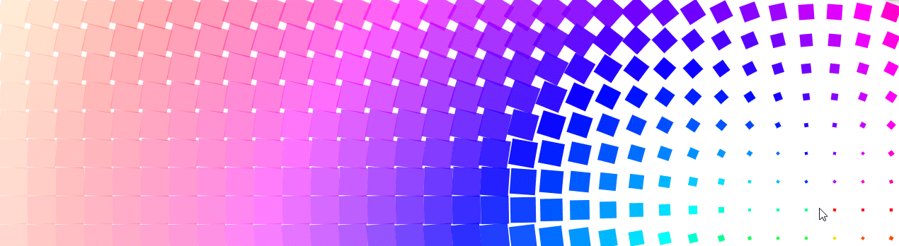

A JavaScript library for Progressive Hover Effects.  
「徐々にHover効果」を制御するJavaScriptライブラリです。
> [demo](https://pokkur.github.io/proxemics/)

## Change Info

2018.08.27

- Add browser library

## Setup

```command
yarn add proxemics
```

### npm

```js
import Proxemics from 'proxemics'
```

or

### browser

```html
<script src="https://cdn.jsdelivr.net/npm/proxemics@latest/dist/proxemics.min.js"></script>
```

## Usage

### Simple case

Proxemics() function require QuerySelector and Option bracket.

```js
Proxemics('.prox', {})
```

Proxemics objects holding `distance`, `angle`, `radian` values.  
There can be controlling on callback function and if you want use to data-attributes.  
Moreover, add/remove class at right timings.

### Optional ([demo](https://pokkur.github.io/proxemics/)) case

Callback mthods for Proxemics 3rd param.

```js
Proxemics('.prox', {
    territory: 100,
    debuggable: true
}, (_, Styles) => {
    if(_.el.classList.contains('one')) {
        Styles({
            filter: `hue-rotate(${_.angle}deg) saturate(${1 - _.distance * .005})`
        })
    }

    if(_.el.classList.contains('two')) {
        Styles({
            boxShadow: `inset 0 0 0 3px hsla(200, 100%, 40%, ${1 - _.distance * .005}`
        })
    }

    if(_.el.classList.contains('three')) {
        Styles({
            transform: `rotate(${_.angle}deg)`
        })
    }

    if(_.el.classList.contains('four')) {
        let speed = Math.min((_.distance / 500) + .2, 1).toFixed(1) // from .2 to 1
        Proxemics.SpeedTune = () => _.el.style.setProperty('--speed', `${speed}s`)
        _.el.style.color = `black`
        _.el.addEventListener('animationiteration', Proxemics.SpeedTune)
        _.el.innerHTML = speed
    }
})
```

```html
<div class="one prox"></div>
<div class="two prox"></div>
<div class="three prox"></div>
<div class="four prox"></div>
```

#### Options

|        Option         |     Default      |                               Description                               |
| --------------------- | ---------------- | ----------------------------------------------------------------------- |
| territory             | _10_             | radius of territory zone (px) / 半径                                    |
| debuggable            | _false_          | display debug / デバッグを表示                                          |
| defaultProxemityClass | _'is-public'_    | default permanence class / Proxemics要素に永続的に付与                  |
| activeProxemityClass  | _'is-proxemity'_ | when if mousemove / カーソルがドキュメント上で移動している際に付与      |
| intimateClass         | _'is-intimate'_  | mousecursor reached territory / カーソルがterritoryに入った際に付与     |
| leftProxemityClass    | _'is-left'_      | when if mouseleave / カーソルがドキュメントから出た際に付与             |
| dataDistance          | _false_          | inject distance value in data-distance/ data-distanceでdistance値を扱う |
| dataAngle             | _false_          | inject angle value in data-angle / data-angleでangle値を扱う            |
| dataRadian            | _false_          | inject radian value in data-radian /data-radianでradian値を扱う         |

## Next

- [ ] throttle option
- [ ] inherit original style
- [ ] destroy method
- [ ] canvas

# License

MIT © Pokkur
